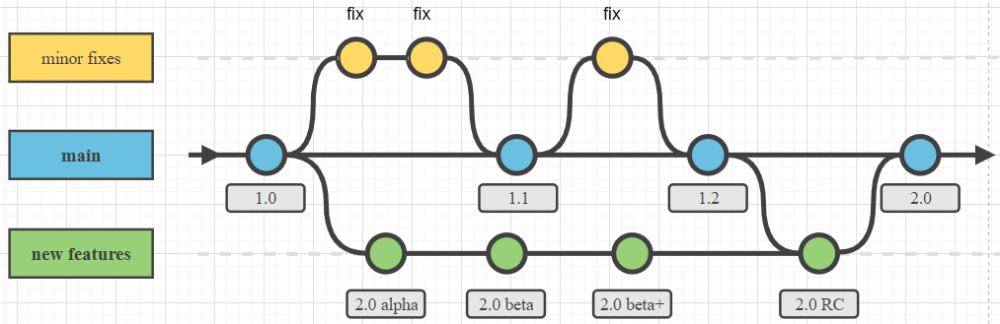

# Maîtriser ses Projets sur GitHub 👨‍💻

## Devenir le Maître de ton Code 🎮

Tu as déjà exploré GitHub et tu sais comment contribuer aux projets d'autrui. Maintenant, il est temps d'apprendre à contrôler et diriger tes propres créations. C'est comme passer du niveau de joueur occasionnel à celui de stratège dans un jeu de rôle. 🛡️

## Création et Gestion d'un Dépôt 🗂️
Dans ce chapitre, on va aborder des points cruciaux :
- Créer un nouveau dépôt : Commencer un nouveau chapitre de ton aventure numérique. 📖
- Gérer les branches : Diriger les courants de ton projet et explorer de nouveaux horizons en toute sécurité. 🌊
- Savoir faire des merges : Fusionner les forces de différentes fonctionnalités pour former une alliance puissante. 🔗

## Collaborer avec d'Autres Développeurs 👥
- Gestion des collaborateurs : Inviter d'autres esprits ingénieux à rejoindre ta quête. 🧙‍♂️🧚‍♀️
- Gérer les Issues et Pull Requests : Trouver des solutions aux énigmes et intégrer les contributions des alliés. 🧩

Tout bon projet sur GitHub mérite son équipe de choc, et dans la prochaine section, ce sera à toi de jouer ! Prépare-toi à devenir le chef d'orchestre de ton propre chef-d'œuvre numérique 🎶👨‍🎤

[Exercises](https://github.com/g404-code-gaming/Cours-Versioning-GitHub/blob/main/Cour/5.Exercise.md)
